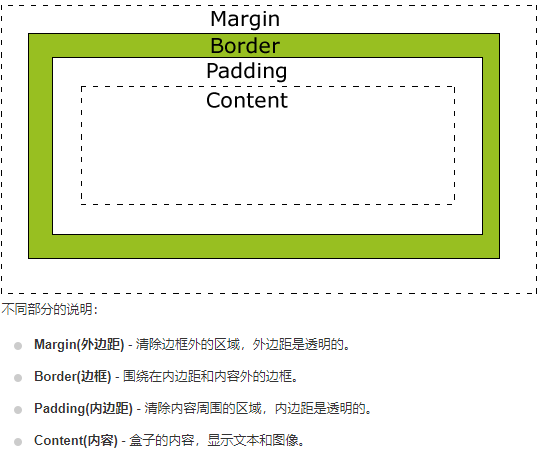

# css

[2020前端面试复习资料](https://www.jianshu.com/p/137b525e09ff)

## 1.盒模型（Box Model）

CSS盒模型本质上是一个盒子，封装周围的HTML元素，它包括：边距，边框，填充，和实际内容。盒模型允许我们在其它元素和周围元素边框之间的空间放置元素。

 

总元素的宽度=宽度+左填充+右填充+左边框+右边框+左边距+右边距  
总元素的高度=高度+顶部填充+底部填充+上边框+下边框+上边距+下边距   
***
## 2.css3弹性盒子（Flex Box）

CSS3 弹性盒子（ Flexible Box 或 flexbox），是一种当页面需要适应不同的屏幕大小以及设备类型时确保元素拥有恰当的行为的布局方式，是对一个容器中的子元素进行排列、对齐和分配空白空间。  

 

***
## 3.css单位

 

rem与em的区别在于使用rem为元素设定字体大小时，仍然是相对大小，但相对的只是HTML根元素  
 

***
## 4.css选择器

 

***
## 5.BFC 清除浮动

BFC 就是清除浮动 用来处理文档脱离文档流的问题  

1. 父元素也添加浮动  
   -   margin 不能使用
2. 给父元素添加一个:display:inline-block
   -   margin 不能使用
3. 给父元素添加高度
   -   扩展性不好，我们无法随意再添加元素
4. br标签
   -   不符合w3c的规范：结构样式行为三者分离。
5. clear样式：规定元素的那一侧不允许其他元素浮动
   
6. after伪类清除浮动(子元素浮动，给父元素添加clearfix类清除浮动)
```
.clear:after{
     content:"";//给元素添加一个空的内容
     display:block;//让这个空的元素成为一个块元素
     clear:both;//再让这个元素旁边两侧都不允许浮动
   }
clear{
    *zoom:1;
}
```

7. 双伪类清除浮动(子元素浮动，给父元素添加clearfix类清除浮动)
```
.clearfix:after,.clearfix:before{
    content: "";
    display: table;
}
.clearfix:after{
    clear: both;
}
clear{
    *zoom:1;
}
```  

## 6.层叠上下文

1. 形成层叠上下文的方法有
```
   1.根元素 <html></html>
   2.position值为 absolute|relative，且 z-index值不为 auto
   3.position 值为 fixed|sticky
   4.z-index 值不为 auto 的flex元素，即：父元素 display:flex|inline-flex
   5.opacity 属性值小于 1 的元素
   6.transform 属性值不为 none的元素
   7.mix-blend-mode 属性值不为 normal 的元素
   8.filter、 perspective、 clip-path、 mask、 mask-image、 9.mask-border、 motion-path 值不为none 的元素
   9.perspective 值不为 none 的元素
   10.isolation 属性被设置为 isolate 的元素
   11.will-change 中指定了任意 CSS 属性，即便你没有直接指定这些属性的值
   12.-webkit-overflow-scrolling 属性被设置 touch的元素
```

2. 层叠等级
   - 普通元素的层叠等级优先由其所在的层叠上下文决定
   - 层叠等级的比较只有在同一个层叠上下文元素中才有意义
   - 在同一个层叠上下文中，层叠等级描述定义的是该层叠上下文中的元素在Z轴上的上下顺序
   - 层叠等级并不一定由 z-index 决定，只有定位元素的层叠等级才由 z-index 决定，其他类型元素的层叠等级由层叠顺序、他们在HTML中出现的顺序、他们的父级以上元素的层叠等级一同决定。

3. z-index
   - z-index 只适用于定位的元素，对非定位元素无效，它可以被设置为正整数、负整数、0、auto，如果一个定位元素没有设置 z-index，那么默认为auto；
   - 元素的 z-index 值只在同一个层叠上下文中有意义。如果父级层叠上下文的层叠等级低于另一个层叠上下文的，那么它 z-index 设的再高也没用。如果遇到 z-index 值设了很大，但是不起作用，就去看看它的父级层叠上下文是否被其他层叠上下文盖住。

4. 层叠顺序
  

    

- [层叠顺序详解](https://www.cnblogs.com/leftJS/p/11063683.html)

## 7.常见页面布局

1. 静态布局
2. 流式布局(百分比布局)
3. 弹性布局(flex布局等)
4. 响应式布局(Bootstrap 提供了一套响应式、移动设备优先的流式栅格系统，grid布局等)

- [常见页面布局](https://www.cnblogs.com/soyxiaobi/p/9594557.html)

## 8.响应式布局

* [响应式布局 Bootstrap](https://v3.bootcss.com/css/#grid)

## 9.css预处理,后处理

* 预处理是一种专门编程语言为css,增加一些编程特性，将css作为目标生成文件
* CSS 后处理器 是对 CSS 进行处理，并最终生成 CSS 的 预处理器，它属于广义上的 CSS 预处理器。
* [css预处理,后处理](http://caibaojian.com/css-processor.html)

## 10.css3新特性
