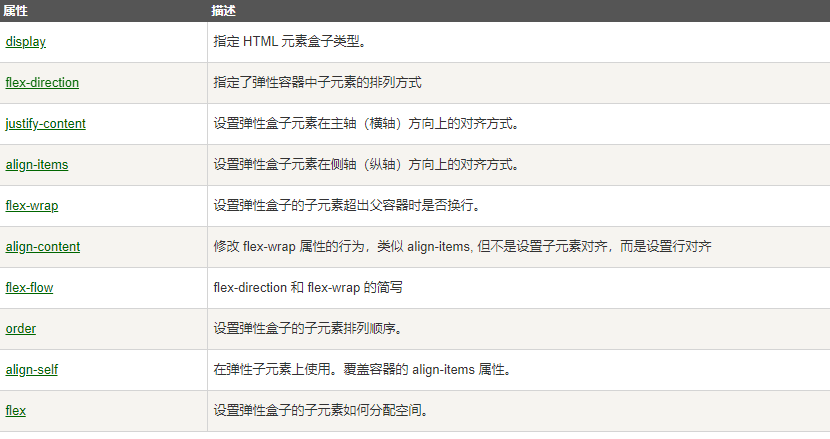
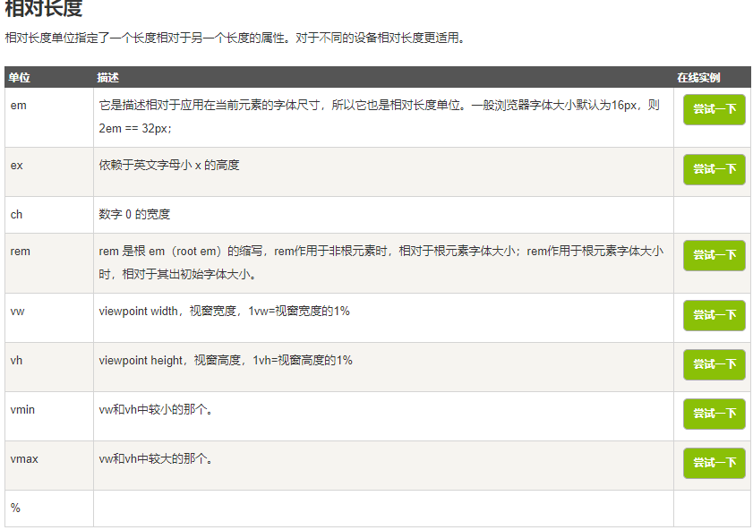
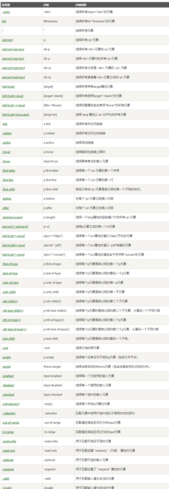
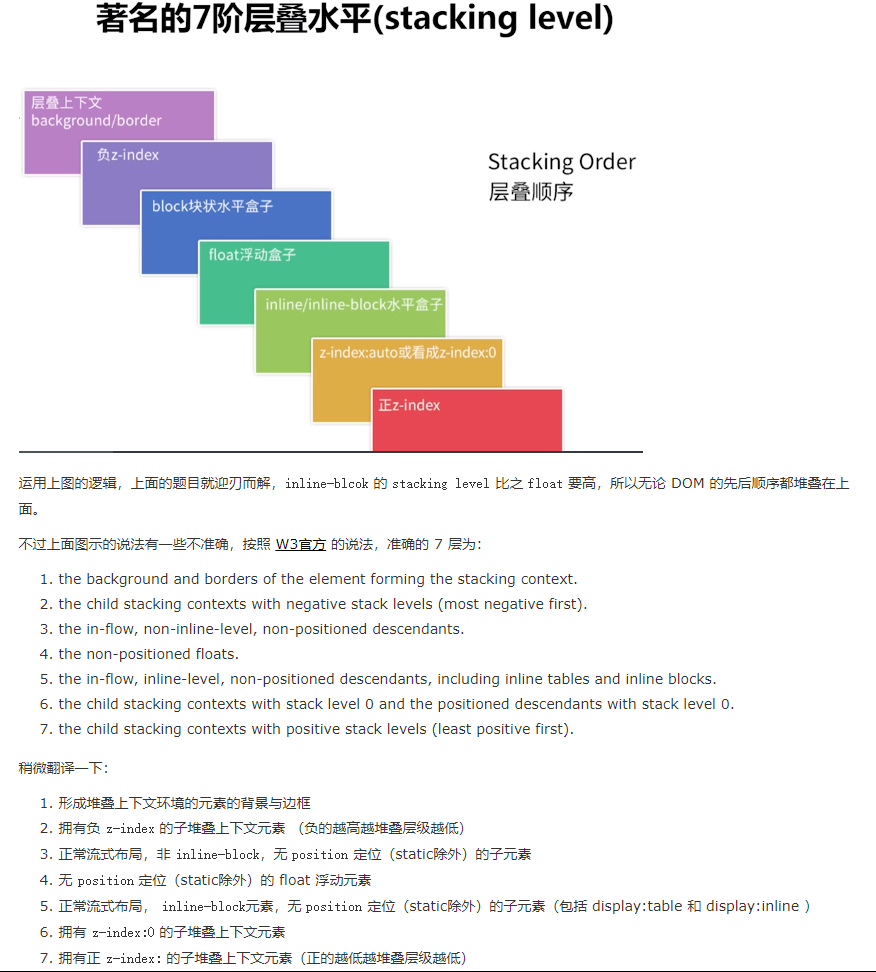
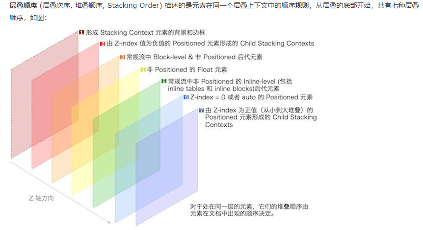
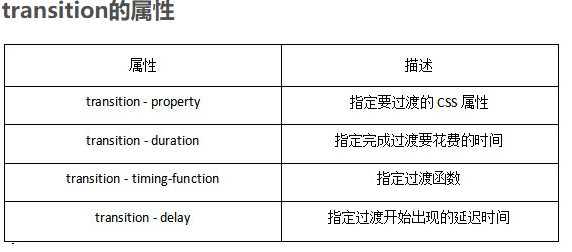
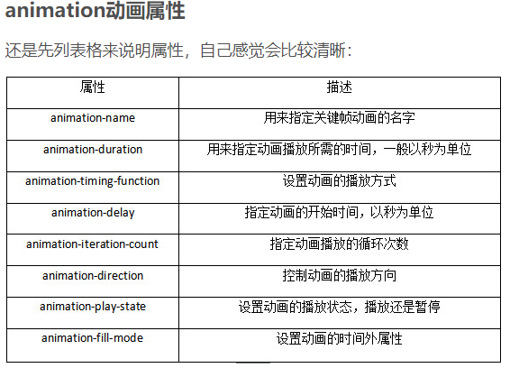
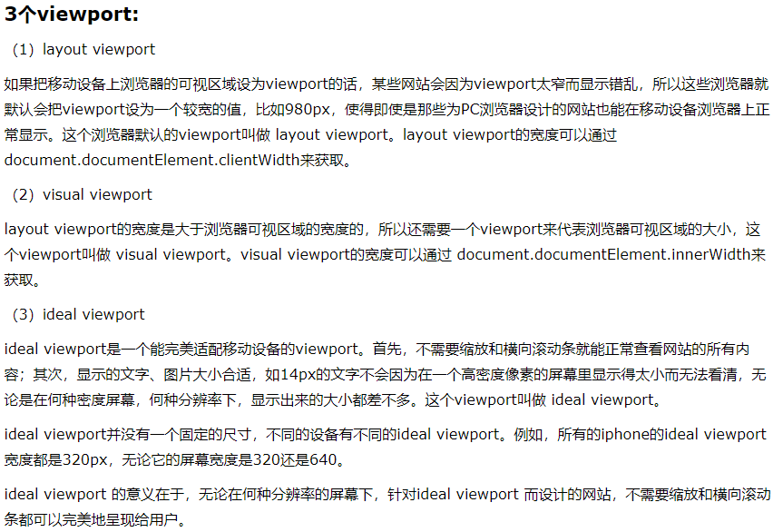

# css面试资料总结

## 1.盒模型（Box Model）

CSS盒模型本质上是一个盒子，封装周围的HTML元素，它包括：边距，边框，填充，和实际内容。盒模型允许我们在其它元素和周围元素边框之间的空间放置元素。


总元素的宽度=宽度+左填充+右填充+左边框+右边框+左边距+右边距  
总元素的高度=高度+顶部填充+底部填充+上边框+下边框+上边距+下边距   
***
## 2.css3弹性盒子（Flex Box）

CSS3 弹性盒子（ Flexible Box 或 flexbox），是一种当页面需要适应不同的屏幕大小以及设备类型时确保元素拥有恰当的行为的布局方式，是对一个容器中的子元素进行排列、对齐和分配空白空间。  

 

***
## 3.css单位

 

rem与em的区别在于使用rem为元素设定字体大小时，仍然是相对大小，但相对的只是HTML根元素  
 

***
## 4.css选择器

 

***
## 5.BFC 清除浮动

BFC 就是清除浮动 用来处理文档脱离文档流的问题  

1. 父元素也添加浮动  
   -   margin 不能使用
2. 给父元素添加一个:display:inline-block
   -   margin 不能使用
3. 给父元素添加高度
   -   扩展性不好，我们无法随意再添加元素
4. br标签
   -   不符合w3c的规范：结构样式行为三者分离。
5. clear样式：规定元素的那一侧不允许其他元素浮动
   
6. after伪类清除浮动(子元素浮动，给父元素添加clearfix类清除浮动)
```
.clear:after{
     content:"";//给元素添加一个空的内容
     display:block;//让这个空的元素成为一个块元素
     clear:both;//再让这个元素旁边两侧都不允许浮动
   }
clear{
    *zoom:1;
}
```

7. 双伪类清除浮动(子元素浮动，给父元素添加clearfix类清除浮动)
```
.clearfix:after,.clearfix:before{
    content: "";
    display: table;
}
.clearfix:after{
    clear: both;
}
.clearfix{
    *zoom:1;
}
```  

## 6.层叠上下文

1. 形成层叠上下文的方法有
```
   1.根元素 <html></html>
   2.position值为 absolute|relative，且 z-index值不为 auto
   3.position 值为 fixed|sticky
   4.z-index 值不为 auto 的flex元素，即：父元素 display:flex|inline-flex
   5.opacity 属性值小于 1 的元素
   6.transform 属性值不为 none的元素
   7.mix-blend-mode 属性值不为 normal 的元素
   8.filter、 perspective、 clip-path、 mask、 mask-image、 9.mask-border、 motion-path 值不为none 的元素
   9.perspective 值不为 none 的元素
   10.isolation 属性被设置为 isolate 的元素
   11.will-change 中指定了任意 CSS 属性，即便你没有直接指定这些属性的值
   12.-webkit-overflow-scrolling 属性被设置 touch的元素
```

2. 层叠等级
   - 普通元素的层叠等级优先由其所在的层叠上下文决定
   - 层叠等级的比较只有在同一个层叠上下文元素中才有意义
   - 在同一个层叠上下文中，层叠等级描述定义的是该层叠上下文中的元素在Z轴上的上下顺序
   - 层叠等级并不一定由 z-index 决定，只有定位元素的层叠等级才由 z-index 决定，其他类型元素的层叠等级由层叠顺序、他们在HTML中出现的顺序、他们的父级以上元素的层叠等级一同决定。

3. z-index
   - z-index 只适用于定位的元素，对非定位元素无效，它可以被设置为正整数、负整数、0、auto，如果一个定位元素没有设置 z-index，那么默认为auto；
   - 元素的 z-index 值只在同一个层叠上下文中有意义。如果父级层叠上下文的层叠等级低于另一个层叠上下文的，那么它 z-index 设的再高也没用。如果遇到 z-index 值设了很大，但是不起作用，就去看看它的父级层叠上下文是否被其他层叠上下文盖住。

4. 层叠顺序

*  

*  

- [层叠顺序详解](https://www.cnblogs.com/leftJS/p/11063683.html)

## 7.常见页面布局

1. 静态布局
2. 流式布局(百分比布局)
3. 弹性布局(flex布局等)
4. 响应式布局(Bootstrap 提供了一套响应式、移动设备优先的流式栅格系统，grid布局等)

- [常见页面布局](https://www.cnblogs.com/soyxiaobi/p/9594557.html)

## 8.响应式布局

* [响应式布局 Bootstrap](https://v3.bootcss.com/css/#grid)

## 9.css预处理,后处理

* 预处理是一种专门编程语言为css,增加一些编程特性，将css作为目标生成文件
* CSS 后处理器 是对 CSS 进行处理，并最终生成 CSS 的 预处理器，它属于广义上的 CSS 预处理器。
* [css预处理,后处理](http://caibaojian.com/css-processor.html)

## 10.css3新特性





## 11.display哪些取值

1. none 此元素不会被显示，并且不占据页面空间，这也是与visibility:hidden不同的地方，设置visibility:hidden的元素，不会被显示，但是还是会占据原来的页面空间。
2. inline 行内元素 元素会在一行内显示，超出屏幕宽度自动换行，不能设置宽度和高度，元素的宽度和高度只能是靠元素内的内容撑开。示例元素：span,b,i,a,u,sub,sup,strong,em
3. block 块级元素 会独占一行，如果不设置宽度，其宽度会自动填满父元素的宽度，可以设置宽高，即使设置了宽度，小于父元素的宽度，块级元素也会独占一行。示例元素：div,h1-h6,ul,ol,dl,p
4. inline-block 行内块元素 与行内元素一样可以再一行内显示，而且可以设置宽高，可以设置margin和padding。示例元素：input,button,img
5. list-item 列表元素。示例元素：li
6. table 会作为块级表格来显示，表格前后带有换行符。
7. inline-table 会作为内联表格来显示，表格前后没有换行符。
8. flex 多栏多列布局，火狐可以直接使用，谷歌和欧朋需要在属性值前面加-webkit-前缀，比较适合移动端开发使用。
9. grid 网格布局 不多比比
10. inherit 继承，如果元素的某些属性没有进行设置，有些是会有默认值的，有些是会继承的。
### 行内元素与块级元素的区别
1. 行内元素：行内元素只能嵌套行内元素，不能嵌套块级元素。  
块级元素：块级元素可以嵌套行内元素，但是行内元素不可以嵌套块级元素。块级元素之间也可以进行嵌套，但是，并不是块级元素之间可以随意的嵌套。p元素是不能嵌套任何块级元素的，div可以嵌套任意的元素，但是div并不是能够被所有的块级元素嵌套的。
2. 行内元素：有margin和padding，但是只能够设置左右的值，设置上下的值是无效的。  
块级元素：可以设置margin和padding上下左右的四个值，margin可以有负值，padding不允许有负值。
3. 行内元素：不允许设置宽高，行内元素的宽高只能是由行内元素内的内容撑起来。  
块级元素：允许设置宽高，如果不设置，默认宽度是父元素的100%，高度是由内容撑起来的。

## 12.相邻的两个inline-block节点为什么会出现间隔，该如何解决？
* 原因：元素被当成行内元素排版的时候，原来HTML代码中的回车换行被转成一个空白符，在字体不为0的情况下，空白符占据一定宽度，所以inline-block的元素之间就出现了空隙。这些元素之间的间距会随着字体的大小而变化，当行内元素font-size:16px时，间距为8px。
* 解决方法：1: font-size。2：改变书写方式。3：使用margin负值。4：使用word-spacing或letter-spacing

## 13.meta viewport 移动端适配

```
//浏览器引进了 viewport 这个 meta tag，让网页开发者来控制 viewport 的大小和缩放。  
<meta name="viewport" content="width=device-width, initial-scale=1.0">
```




## 14.CSS实现宽度自适应100%，宽高16:9的比例的矩形

```
<!DOCTYPE html>
<html lang="en">
<head>
    <meta charset="UTF-8">
    <meta name="viewport" content="width=device-width, initial-scale=1.0">
    <title>test</title>
</head>
<body>
    <style>
        *{
            margin: 0;
            padding: 0;
        }
        .box{
            width: 50vw;
            margin: 0 auto;
        }
        .sq{
            width: 100%;
            padding-bottom: 56.25%;
            height: 0;
            position: relative;
            background-color: pink;
        }
        .sq>p{
            width: 100%;
            height: 100%;
            position: absolute;
            background-color: pink;
        }
    </style>

</body>
<div class="box">
    <div class="sq">
        <p>16:9</p>
    </div>
</div>
</html>
```

## 15.rem布局的优缺点

* 优点：在手机各个机型的适配方面；大大减少我们代码的重复性，是我们的代码更兼容。  
* 缺点：目前ie不支持 对pc页面来讲使用次数不多；数据量大：所有的图片，盒子都需要我们去给一个准确的值；才能保证不同机型的适配；

## 16.画三角形

* [三角形绘制 border法](https://www.jianshu.com/p/9a463d50e441)

```
.box{
   width: 0;
   height: 0;
   border-width: 100px;
   border-style: solid;
   /* transparent 透明 */
   border-color: blue gray #1e90ff green;
}
<div class="box"></div>

```

## 17.1px边框问题

* 原因：viewport的设置和屏幕物理分辨率是按比例而不是相同的. 移动端window对象有个devicePixelRatio属性, 它表示设备物理像素和css像素的比例, 在retina屏的iphone手机上, 这个值为2或3, css里写的1px长度映射到物理像素上就有2px或3px那么长。
* 解决方法 [如何解决1px问题](https://blog.csdn.net/SilenceJude/article/details/81906716)